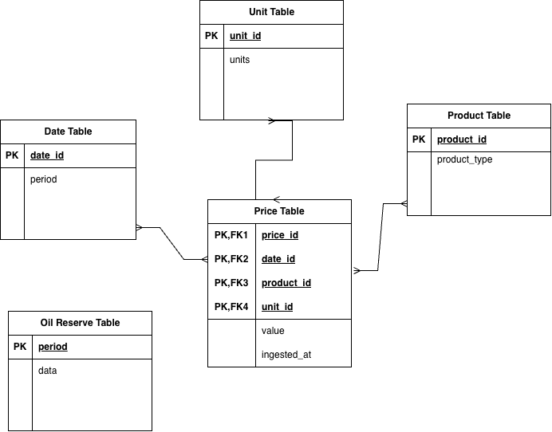
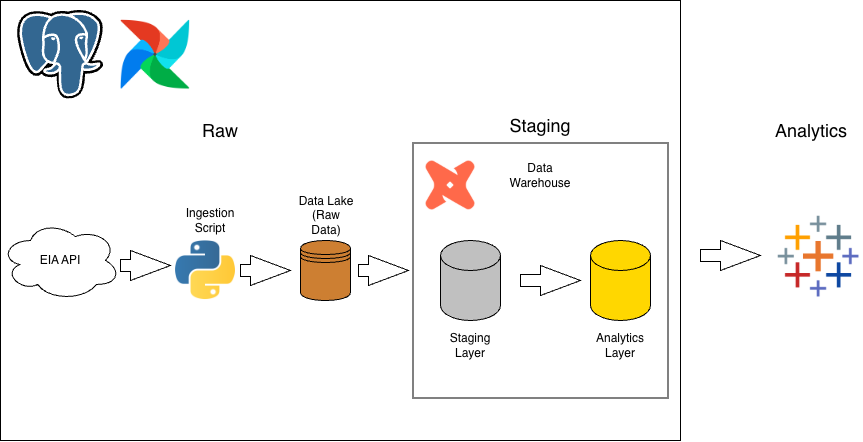
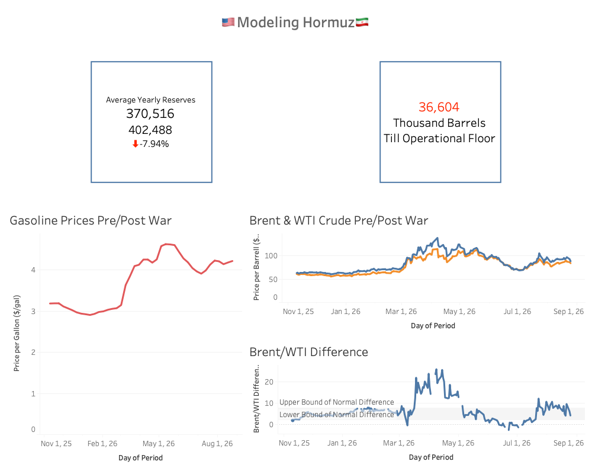

# Modeling Hormuz (using dbt and Tableau)

## Background and Overview
On February 28th, 2026, the U.S. and Israel launched joint attacks on Iran in what is known as "Operation Epic Fury" (OEF). What was supposed to be a quick operation focused on destroying Iran's nuclear capabilities and encouraging regime change later became the months-long Iran War. Shortly after the initial attacks, the IRGC (Islamic Revolutionary Guard Corps) closed the Strait of Hormuz, one of the most vital choke points for oil and gas trade, along with non-oil materials such as fetilizers and helium. Many countries across Asia, Europe, and North America rely on the oil and gas exported from this region, which lead to an oil crisis across the globe.

This project's focus is on the volatility of the oil industries affected by the closure of Hormuz, along with the potential dangers of continual oil repository withdrawal. There are four variables important to the health of the oil industry in the United States

- Brent Crude Oil is the primary oil resource exported via the Strait of Hormuz, and is the primary source of oil for various countries in Europe and Asia, especially China. It often serves as the international benchmark for oil, as it supplies two-thirds of the world's oil.

- WTI Crude Oil is the primary oil resource for North America, as it is extracted primarily in Cushing, Oklahoma. WTI Crude is similar in quality to Brent Crude, but is often cheaper in North America due to the lack of import costs.

- Gasoline is an important metric to follow when observing activity in the Strait of Hormuz, as about one-fifth of the world's natural gas flows through the strait. Natural Gas is important globally, but especially for the United States given the heavy reliance on gasoline for commerce and transportation.

- SPR are reserves across the U.S. that store crude oil in case of emergency. The SPR can hold up to 714 million barrels of crude oil and has an operational floor of 250 million due to the structure of the reserves. The U.S. will often use the SPR during periods of volatility, such as the oil surge from the Russia-Ukraine War, and is refilled during times of stability.

## Data Sourcing and Architecture

The data pulled for this project comes primarily from the EIA, the U.S. leading agency for energy data and insights. Below is the structure of the data used, along with additional data sources used as supporting information.

## Data Pipeline

The data pipeline is broken down into three schemas: raw, staging, and analytics. In the raw layer, I use a Python script to pull information from the EIA's API to get up-to-date information on oil and gas pricing. The script pulls the information in a JSON format, then uses Pandas to flatten the json and insert the data into our data lake. From this data lake, I use DBT to transform the data, extracting only necessary information and fixing data formatting. DBT then runs tests on the staging layer, verifies all tests have passed, then runs the analytics scripts. The analytics scripts are then tested and placed into the analytics layer. This layer is what Tableau then uses to visualize the data.

## Executive Summary

### Overall Findings

Before the Iran War, the value of Brent Crude and WTI Crude hovered below $70 a barrel, considered a safe and stable range for the oil market. After Operation Epic Fury, the price for both Brent and WTI shot up, ranging from the high $80s to over $110 dollars, posing major risks in global oil stability. Gasoline pricing also saw a spike in pricing from sub-$2 pre-war to over $3.2 dollars post-OEF.

From the EIA's SPR data, we see an average of around 370 million barrels in 2026, down from last year's average of 402 million barrels. The current value, as of September 4th, 2026, is 36.604 million barrels from the operational floor of the SPR, which is concerning given the average yearly decrease being around 30 million barrels. The SPR situation seems to be caused in part due to the closure of the Strait of Hormuz and the failure to fill the SPR before OEF and after the Russian-Ukraine War had tempered.

### Trends
- Brent Crude and WTI Crude both increased dramatically after OEF, but Brent saw the more dramatic increase of the two. The spread between Brent and Crude saw values range from -$3.7 to $16.97 during March and April 2026, with a normal range being between $2 to $8.
- Gasoline continues to hover above $3 a gallon, up from the sub-$2 range pre-war. With gas taxes and processing costs, many regions across the United States are experiencing average gas prices of $4.15 a gallon.
- The SPR is trending downward from last year, seeing an average difference of 30 million barrels from last year to this year (-7.94% YoY). The SPR is trending close to the operational floor, which would trigger the Energy Policy and Conservational Act (EPCA) and stop the extraction of oil. The triggering of this act, if war efforts were to continue past this point, would most likely lead to a spike in Crude Oil pricing, as the U.S. SPR has helped slow down any dramatic spikes in Crude Oil

## Reccommendations

Based on the results above, the following recommendations can be made

- *Negotiation:* for the oil market, the trends associated with increased military action tend to increase both Brent and WTI Crude pricing, and subsequent ceasefire agreements and scaled down military operations have tamed the price fluctuations. As the war continues, the SPR saw rapid decreases in estimated inventory, with only ~36 million barrels till the operational floor. To prevent a greater crisis and decrease volitility, negotating a deal with Iran would potentially stop further SPR draw and stabilize Crude Oil pricing.
- *Diversifying Energy Supply:* The U.S. gets 83% of its energy supply from fossil fuels, further amplifying the oil crisis. Investments in diverse energy sectors, such as nuclear, solar, and wind, would reduce the U.S's reliance on foreign oil to operate

## Sources used:
[EIA](https://www.eia.gov/)

[DMDC](https://dcas.dmdc.osd.mil/dcas/home)

[ACLED](https://acleddata.com/)

[U.S. Energy Diversity](https://www.eia.gov/todayinenergy/detail.php?id=62444)